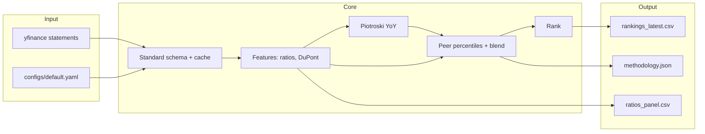

# Financial health scoring & company ranking

## Results (default peer set: WMT, TGT, COST, AMZN, KR)

Run `python main.py` to refresh; numbers move with **yfinance** data. Snapshot from the last successful pipeline run:

| Rank | Ticker | Composite | Raw composite | Profit | Liq | Lev | Eff | Piotroski F |
|:---:|:---:|:---:|:---:|:---:|:---:|:---:|:---:|:---:|
| **1** | **COST** | **81.7** | 86.7 | 79 | 80 | **100** | 90 | 6 |
| 2 | AMZN | 71.8 | 73.6 | 73 | **100** | 80 | 40 | 6 |
| 3 | TGT | 56.1 | 52.6 | 68 | 50 | 51 | 30 | 6 |
| 4 | WMT | 52.1 | 47.3 | 60 | 20 | 49 | 50 | 6 |
| **5** | **KR** | **46.7** | 40.0 | **20** | 50 | **20** | 90 | 6 |

- **Leader:** **COST** — highest **composite**; **leverage** pillar tops the set (low relative debt load vs equity in this cross-section) and **efficiency** is strong (revenue per dollar of assets and inventory turns vs peers).
- **Laggard:** **KR** — **profitability** and **leverage** pillars trail; **efficiency** is high but cannot offset the weight on returns and balance-sheet risk *as defined in your YAML weights*.

**How to read scores:** `composite_score` blends peer-percentile pillars with Piotroski (see `configs/default.yaml`). **Higher = stronger vs this list only**, not vs the whole market.

---

## Key insights (why the order is not random)

1. **Peer percentiles, not absolutes.** A company “wins” a pillar by ranking high on *this* ticker list. COST’s leverage score is 100 because its **debt-to-equity and interest coverage** look best *among these five*, not because debt is zero in an absolute sense.

2. **Tradeoff: margin vs turns vs leverage.** AMZN posts the **strongest liquidity** score and solid profitability, but **asset turnover** (and thus the efficiency pillar) is weak *relative to discounters*—asset-heavy economics vs high-velocity retail. That is an **interpretable** pattern, not a bug.

3. **Piotroski ties here don’t decide the stack.** All five show **F = 6** in the snapshot; the **spread in rankings** comes from the **pillar composite** (profitability, liquidity, leverage, efficiency). Piotroski adds a **trend and quality** layer via the blend; when F is flat, pillars dominate.

4. **Use pillars to tell a story.** If leadership is driven by `score_leverage` and `score_efficiency`, the narrative is balance-sheet discipline plus operating velocity. If `score_profitability` alone leads, the narrative is returns and margins—then check whether leverage is hiding risk (read `debt_to_equity` and `interest_coverage` in `output/rankings_latest.csv`).

---

## What this system shows

- **Strengths and weaknesses** surface as **four pillar scores** plus **F-score trend context**, then one **ranked decision ordering** for the configured peer set.
- **Rankings depend entirely on the peer set** in `configs/default.yaml`. Swapping tickers changes percentiles—by design.
- **Single metrics lie.** High ROE with extreme leverage or weak liquidity is visible only when you read **pillars and raw ratios together** (`rankings_latest.csv` exports both).

---

## Problem

Investors and analysts compare operators under **uncertainty**: filings are noisy, line items differ by vendor, and spreadsheet templates hide **which** fundamentals drive relative quality. Decisions need a **repeatable** view of **who leads this cohort on economics and risk**, not another static chart.

---

## Solution

A **batch pipeline** pulls multi-year statements, builds a **standard schema**, computes **ratios + DuPont checks**, scores **year-over-year Piotroski**, maps everything to **cross-sectional percentiles** within your list, blends scores, and writes **ranked outputs** for analysis or UI.

---

## Architecture



---

## How to use

| Audience | Use |
|----------|-----|
| **Investors / PMs** | Run the pipeline, read `rankings_latest.csv` for **ordered peers**, then drill **pillar columns** and **ROE / D/E / current_ratio** for the thesis. |
| **Analysts** | Use `ratios_panel.csv` for **multi-year** trends; use DuPont columns to sanity-check **ROE drivers**. |
| **Benchmarking** | Edit **tickers** to match a GICS peer list or custom cohort; re-run—**scores are only comparable within that run**. |

```bash
pip install -e ".[dev]"
python main.py                 # batch pipeline
python -m pytest evaluation/ -q
streamlit run src/dashboard.py # optional: same CSVs, no re-scoring unless you click refresh
```

---

## Important note

**Rankings are relative to the peer set in config, not absolute truth.** A #1 here is “best of this list on this methodology,” not “best stock.” Never cite scores without naming **peers**, **fiscal year** (`fiscal_year` column), and **data vintage** (yfinance pull / cache).

---

## Limitations

- **yfinance mapping:** Labels vary; missing lines → **NaN** ratios, not imputed values.
- **Scoring model:** Weights and peer percentile design are **transparent but subjective**—tune in YAML for your mandate; defaults are for **retail-style** comparison.
- **Altman Z:** Uses **market_cap / total_liabilities** for X4; `market_cap` is **one snapshot at download**—fine for screening, **not** for strict historical Altman replication.
- **Fiscal years:** Mixed fiscal month-ends; rows are **labeled by fiscal year**, not calendar-aligned.
- **Piotroski signal 7:** Needs share counts; see `piotroski_note` in outputs.

---

## Repository layout

```
configs/default.yaml   # tickers (≥5), weights, cache
data/cache/            # Parquet cache (ignored except .gitkeep)
features/              # ratios, DuPont
scoring/               # Piotroski, composite
ranking/               # order → health_rank
evaluation/            # pytest
src/                   # loader, pipeline, cli, dashboard
output/                # produced by pipeline
main.py
```

Primary outputs: **`output/rankings_latest.csv`**, **`output/ratios_panel.csv`**, **`output/methodology.json`**, **`output/run_summary.json`**.

---

## Data

Figures are **third-party** via yfinance; verify material conclusions against **SEC filings** and company IR.
